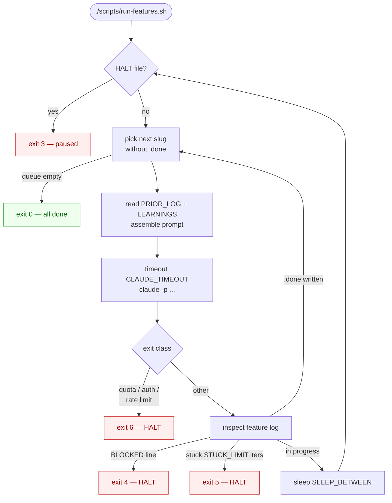
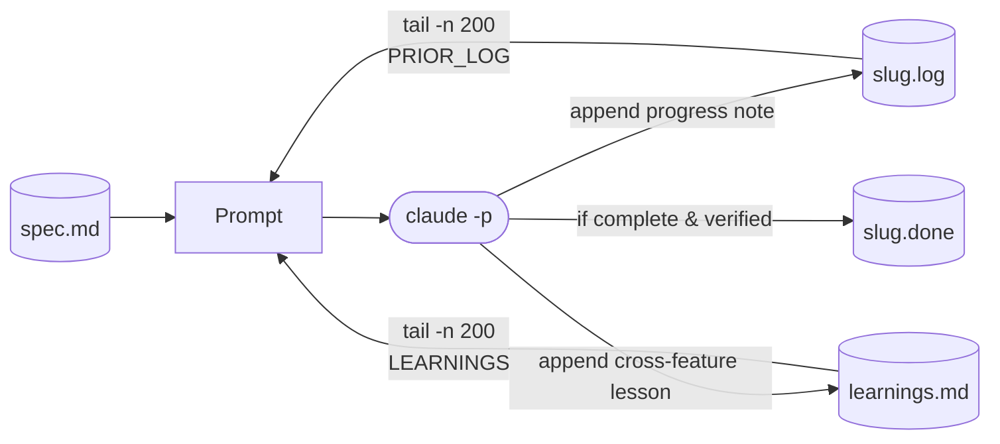

# harness-loop

A drop-in headless feature runner for any spec-driven project. Loops `claude -p` over `specs/*` until each feature has a verified `.done` marker. Self-evolves: every iteration sees the prior attempt log and a global learnings file.

Project-agnostic. The runner makes no assumptions about your project's language or test runner.

> **TL;DR**
> - One bash script (`scripts/run-features.sh`) + one ordering file + one base permissions file.
> - Drop into any repo with a `specs/<slug>/spec.md` layout (override paths if needed).
> - Resumable, interruptible, halts on quota/auth errors; circuit breaker stops silent wheel-spinning.

---

## How it works

The runner is a single bash loop. Every iteration picks the next feature without a `.done` marker, builds a prompt that includes the feature's prior attempt log + cross-feature learnings, and invokes `claude -p`. Halt branches are color-coded; click any of them to jump to its exit code below.



---

## Self-evolution

Two files carry feedback across iterations; a circuit breaker catches the case where the feedback channel goes silent.



- **PRIOR_LOG** — the same feature's prior attempts. Stops Claude retrying failed approaches.
- **LEARNINGS** — lessons that apply across features (env quirks, dependency gotchas). A lesson written during feature A is in the prompt when feature D starts.
- **Circuit breaker** — if the feature log grows ≤32 B for `STUCK_LIMIT` iterations, the loop halts (exit 5). The runner can't audit *what* gets logged, only *whether* anything does.

The quality of self-evolution is bounded by how diligently Claude logs. The prompt language asking for a progress note + cross-feature lesson is load-bearing — weakening it weakens the whole loop.

---

## Quick start

From the target project's repo root:

```bash
# 1. Copy the runner + ordering file
cp -r /path/to/harness-loop/scripts ./
chmod +x scripts/run-features.sh

# 2. Merge the base permissions allowlist
cp /path/to/harness-loop/.claude/settings.json .claude/settings.json

# 3. Ignore runtime state
printf '\n# Feature runner runtime state\nlogs/\n' >> .gitignore

# 4. Dry-run — prints the resolved queue and the prompt for the next feature, no claude calls
DRY_RUN=1 ./scripts/run-features.sh

# 5. Smoke-test on one feature
MAX_ITERATIONS=2 ONLY=<slug> ./scripts/run-features.sh

# 6. Full run
MAX_ITERATIONS=200 CLAUDE_TIMEOUT=30m ./scripts/run-features.sh
```

Pause: `touch logs/feature-runner/HALT`. Resume: `rm logs/feature-runner/HALT`. `.done` markers persist, so resume just skips already-completed features.

---

## Spec layout

```
<repo root>/
├── specs/                         <- $SPECS_DIR (default: "specs")
│   ├── auth-login/
│   │   └── spec.md                <- $SPEC_FILE (default: "spec.md")
│   ├── billing-stripe/
│   │   └── spec.md
│   └── search-typeahead/
│       └── spec.md
├── scripts/
│   ├── run-features.sh
│   └── feature-order.txt          <- optional dependency ordering
├── .claude/settings.json
└── logs/feature-runner/           <- created on first run, .gitignore'd
    ├── run.log                    <- outer-loop chronological record
    ├── learnings.md               <- cross-feature lessons
    ├── auth-login.log             <- per-feature attempt log (PRIOR_LOG source)
    ├── auth-login.done            <- presence = feature accepted
    └── HALT                       <- sentinel; if present, loop exits 3
```

Custom layout: `SPECS_DIR=docs/specs SPEC_FILE=README.md ./scripts/run-features.sh`.

The runner doesn't parse `spec.md` — Claude reads it as natural language. A spec that includes explicit verification expectations ("test X must pass", "endpoint Y returns Z") gives Claude a clear "done" target and prevents premature `.done` markers.

---

## Configuration

All knobs are env vars; none require editing the script.

| Var | Default | Purpose |
|---|---|---|
| `SPECS_DIR` | `specs` | Directory containing one subdirectory per feature. |
| `SPEC_FILE` | `spec.md` | Filename of the spec inside each feature directory. |
| `MAX_ITERATIONS` | `200` | Hard cap on iterations; loop exits 0 if everything `.done` first. |
| `CLAUDE_TIMEOUT` | `30m` | Per-iteration timeout. Bump for long-running features. |
| `ONLY` | _(unset)_ | Comma-separated slug filter (`ONLY=a,b`). |
| `STUCK_LIMIT` | `3` | Iterations of no log growth before circuit breaker halts. |
| `SLEEP_BETWEEN` | `2` | Seconds between iterations. |
| `ORDER_FILE` | `scripts/feature-order.txt` | Re-read every iteration; editing mid-run is supported. |
| `DRY_RUN` | `0` | `1` prints the resolved queue + next prompt and exits. |
| `MODEL` | `claude-sonnet-4-6` | Override to `claude-opus-4-7` for hard features, `claude-haiku-4-5-20251001` for cheap ones. |

---

## Exit codes

| Code | Meaning |
|---|---|
| 0 | All eligible features completed |
| 1 | Reached `MAX_ITERATIONS` with features still pending |
| 2 | Preflight failed (missing `claude` / `timeout`, no specs dir, log dir not writable) |
| 3 | `HALT` file present at startup |
| 4 | `BLOCKED:` signal in a feature log |
| 5 | Circuit breaker tripped (`STUCK_LIMIT` consecutive iterations with no log growth) |
| 6 | Hard external limit detected (quota, rate limit, auth) |
| 130 | Interrupted (Ctrl-C / SIGTERM) |

---

## Runtime files

Everything is in `logs/feature-runner/` — no database, no metadata store.

| Path | Purpose |
|---|---|
| `run.log` | Outer-loop chronological record (one line per event). |
| `<slug>.log` | Per-feature attempt log; `claude -p` stdout/stderr appended each iteration. Source of `PRIOR_LOG`. |
| `<slug>.done` | Presence = feature accepted. Content is Claude's one-line completion summary. |
| `learnings.md` | Cross-feature lessons, one per line, date-prefixed. Source of `LEARNINGS`. |
| `HALT` | Sentinel. If present at iteration start, loop exits 3. Auto-written on exit 4/5/6. |

Re-queue a feature: `rm logs/feature-runner/<slug>.done`.

---

## Troubleshooting

<details>
<summary>Circuit breaker keeps tripping on the same feature</summary>

Read `logs/feature-runner/<slug>.log`. Common causes:
- The spec is ambiguous and Claude has no human to ask. Rewrite the spec with explicit acceptance criteria.
- A test is genuinely flaky. Stabilize it outside the loop, or document the workaround in `learnings.md`.
- A required dep is missing. Install it, then `rm HALT` and re-run.
</details>

<details>
<summary>Claude wrote .done but the feature isn't really done</summary>

The runner trusts the marker. To recover: `rm logs/feature-runner/<slug>.done` to re-queue, and tighten the spec's verification expectation. If this is a pattern, strengthen step 6 of the prompt in `scripts/run-features.sh`.
</details>

<details>
<summary>Halted with exit 6 (hard limit)</summary>

Quota or auth issue. Check the tail of the most recent feature log for the actual error. Rotate the API key or wait for the quota window, then `rm HALT` and resume.
</details>

<details>
<summary>Want to see the prompt for an arbitrary feature</summary>

`ONLY=<slug> DRY_RUN=1 ./scripts/run-features.sh` — prints the exact prompt that would be sent.
</details>

<details>
<summary>Runs feel too slow / too expensive</summary>

- Drop to Haiku: `MODEL=claude-haiku-4-5-20251001`.
- Tighten `CLAUDE_TIMEOUT` to fail fast on stalled iterations.
- Use `ONLY=...` to focus on the features that actually need work.
</details>

---

## What this is NOT

- **Not a planner.** It does not decompose specs into tasks. Claude does that inside each iteration.
- **Not a verifier.** Verification is delegated to Claude. The runner only trusts the `.done` marker.
- **Not language-specific.** The base permission allowlist is opinionated about common tools but you can swap it freely.

---

## Files

| Path | Purpose |
|---|---|
| `scripts/run-features.sh` | The runner. |
| `scripts/feature-order.txt` | Template ordering file. Edit per project. |
| `.claude/settings.json` | Base permission allowlist. Merge with target project's existing settings. |
| `CLAUDE.md` | Guidance for Claude Code working on *this* repo (not target projects). |

A non-trivial run is a multi-hour, multi-million-token operation. `.done` markers make resume cheap, so interrupt and continue freely.
