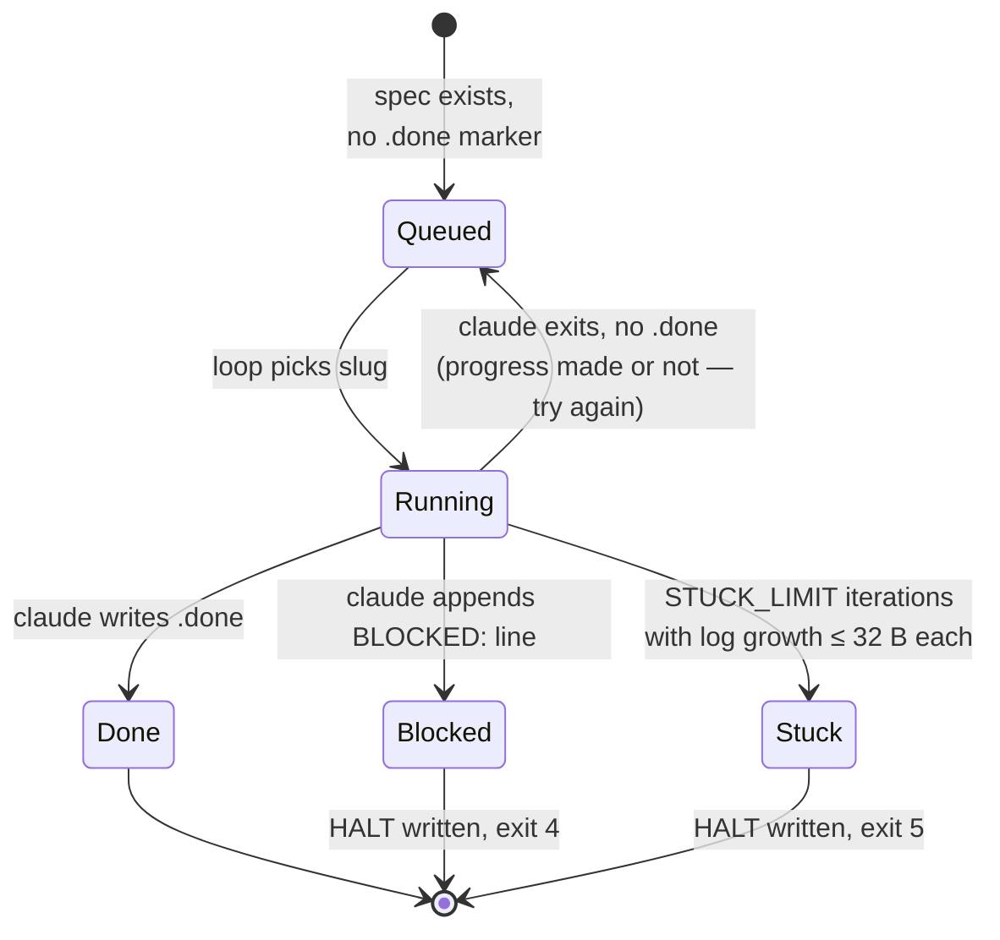
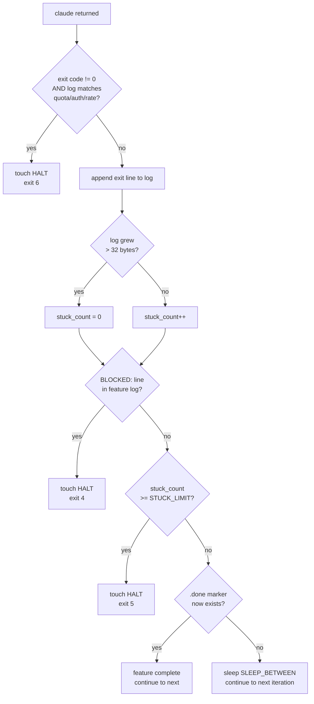

# harness-loop

A drop-in headless feature runner for any spec-driven project. Walks through `specs/*` and drives each spec to a verified `.done` marker by invoking `claude -p` per iteration. Self-evolves: every iteration reads the prior attempt log + a global learnings file, so failed approaches don't get silently retried.

Project-agnostic. No assumptions about workflow framework, language, or test runner — it just takes specs and completes the task.

---

## TL;DR

- One bash script (`scripts/run-features.sh`) + one ordering file + one base permissions file.
- Drop into any repo with a `specs/<slug>/spec.md` layout (override paths if needed).
- Loops `claude -p` until each feature has a `.done` marker. Resumable, interruptible, halts on quota/auth errors.
- Self-evolves: each iteration sees the prior attempt log and cross-feature learnings.

---

## Table of contents

- [Why this exists](#why-this-exists)
- [How it works](#how-it-works)
  - [One iteration (sequence)](#one-iteration-sequence)
  - [Per-feature lifecycle (state)](#per-feature-lifecycle-state)
  - [Halt-decision tree](#halt-decision-tree)
- [Spec layout](#spec-layout)
- [Prerequisites](#prerequisites)
- [Install into a target project](#install-into-a-target-project)
- [Run](#run)
- [Configuration knobs](#configuration-knobs)
- [One iteration in detail](#one-iteration-in-detail)
- [Self-evolution](#self-evolution)
- [Resilience & halt reasons](#resilience--halt-reasons)
- [Exit codes](#exit-codes)
- [Runtime files reference](#runtime-files-reference)
- [Cost & time](#cost--time)
- [Troubleshooting](#troubleshooting)
- [What this is NOT](#what-this-is-not)
- [Files in this folder](#files-in-this-folder)

---

## Why this exists

The naive version of "drive specs to completion with Claude" is a one-liner:

```bash
for slug in specs/*/; do claude -p "implement $slug"; done
```

It falls over the moment anything real happens:

| Failure mode | What this runner does instead |
|---|---|
| One iteration stalls forever waiting on a flaky test or hung browser | `timeout $CLAUDE_TIMEOUT` per call; loop continues |
| Claude tries the same wrong approach 30 iterations in a row | Last 200 lines of the feature's prior log are injected into every prompt |
| A lesson learned solving feature A is forgotten by feature D | Cross-feature `learnings.md` is read on every iteration of every feature |
| Quota / auth error mid-run wastes 50 iterations against a dead key | Hard-limit regex on stderr halts immediately, writes `HALT` |
| Claude silently does nothing for hours | Circuit breaker on log-size stagnation halts after `STUCK_LIMIT` no-op iterations |
| Crash mid-run loses all progress | `.done` markers are durable files; resume just skips them |
| Half-finished feature gets accepted | Prompt tells Claude not to write `.done` unless verified; trust is binary at the marker level |

Net effect: a multi-hour, multi-feature unattended run that survives the things that actually go wrong.

---

## How it works

### One iteration (sequence)

```mermaid
sequenceDiagram
    autonumber
    participant L as Outer loop<br/>(run-features.sh)
    participant FS as Filesystem<br/>(specs/, logs/)
    participant C as claude -p
    participant T as Target project<br/>(code, tests, browser)

    L->>FS: read scripts/feature-order.txt
    L->>FS: scan SPECS_DIR; skip .done markers
    L->>L: pick next slug
    L->>FS: tail -n 200 <slug>.log → PRIOR_LOG
    L->>FS: tail -n 200 learnings.md → LEARNINGS
    L->>L: assemble prompt<br/>(spec path + PRIOR_LOG + LEARNINGS + steps 1-6)
    L->>C: timeout CLAUDE_TIMEOUT claude -p ...
    C->>FS: read spec, CLAUDE.md
    C->>T: implement next step (Edit / Write / Bash / MCP)
    C->>T: verify (pytest / npm test / curl / browser)
    C->>FS: append progress note to <slug>.log
    C-->>FS: maybe append one-liner to learnings.md
    C-->>FS: if complete: write <slug>.done
    C-->>L: exit code (0 / 124 / other)
    L->>FS: stat <slug>.log → size delta check
    L->>L: stuck_count++ or reset
    L->>FS: grep ^BLOCKED: <slug>.log
    L->>L: halt (HALT + exit) OR sleep & loop
```

### Per-feature lifecycle (state)



### Halt-decision tree

What happens at the end of each iteration, in order:



---

## Spec layout

The runner discovers features by listing subdirectories of `$SPECS_DIR`. Each subdirectory is one feature. The directory name is the **slug** — used for the log filename, `.done` marker, ordering file, and `ONLY=` filter.

Default layout the runner expects:

```
<repo root>/
├── specs/                       <- $SPECS_DIR (default: "specs")
│   ├── auth-login/              <- slug: "auth-login"
│   │   └── spec.md              <- $SPEC_FILE (default: "spec.md")
│   ├── billing-stripe/
│   │   └── spec.md
│   └── search-typeahead/
│       └── spec.md
├── scripts/
│   ├── run-features.sh
│   └── feature-order.txt
├── .claude/
│   └── settings.json
└── logs/                        <- created on first run, .gitignore'd
    └── feature-runner/
        ├── run.log
        ├── learnings.md
        ├── auth-login.log
        ├── auth-login.done       <- presence = feature accepted
        └── billing-stripe.log
```

If your project uses a different layout, override:

```bash
SPECS_DIR=docs/specs SPEC_FILE=README.md ./scripts/run-features.sh
```

**What goes in `spec.md`?** That's up to you — the runner doesn't parse it. Claude reads it as natural language. Useful things to put in:
- The user-facing problem and acceptance criteria.
- Any technical constraints (DB schema, API contract, performance budget).
- Verification expectation: which tests should pass, which endpoint should respond, which UI should render — so Claude knows what "done" looks like.

A spec that says "the search box should suggest results as the user types" with no verification hint will get a half-baked implementation. A spec that says "Cypress test `tests/search.cy.ts` must pass; first suggestion appears within 200ms of last keystroke" gives Claude a target.

---

## Prerequisites

- `claude` CLI on `$PATH`. Tested with Claude Code 2.1.x.
- GNU `timeout` (coreutils). Pre-installed on Linux. On macOS install with `brew install coreutils` and ensure `gtimeout` is symlinked or aliased.
- A directory of specs as described above.

That's the whole contract. If your project mandates a workflow framework (SDD, BDD, custom slash commands), document it in CLAUDE.md at the repo root — step 1 of the prompt instructs Claude to read CLAUDE.md and follow its conventions.

---

## Install into a target project

From the target project's repo root:

```bash
# 1. Copy the runner + ordering file
cp -r /path/to/harness-loop/scripts ./
chmod +x scripts/run-features.sh

# 2. Merge the base permissions allowlist with your existing .claude/settings.json
#    (or just copy it if you don't have one yet)
cp /path/to/harness-loop/.claude/settings.json .claude/settings.json

# 3. Ignore runtime state
printf '\n# Feature runner runtime state\nlogs/\n' >> .gitignore

# 4. Optional: set dependency order
$EDITOR scripts/feature-order.txt
```

The base allowlist in `.claude/settings.json` covers common read-only inspection commands and the major test runners (pnpm/npm/pytest/uv). Add your own as needed.

---

## Run

**Always dry-run first.** It prints the resolved queue and the prompt that would go to `claude` for the next pending feature, without spending a single token:

```bash
DRY_RUN=1 ./scripts/run-features.sh
```

Sample output:

```
[2026-04-27T12:00:00+00:00] Resolved feature queue (in execution order):
[2026-04-27T12:00:00+00:00]   - auth-login
[2026-04-27T12:00:00+00:00]   - billing-stripe [done]
[2026-04-27T12:00:00+00:00]   - search-typeahead
[2026-04-27T12:00:00+00:00] === iteration 1 / 200 ===
[2026-04-27T12:00:00+00:00] Target feature: auth-login (stuck count: 0/3)
[2026-04-27T12:00:00+00:00] DRY_RUN=1 — printing the prompt for 'auth-login' ...
----- PROMPT (feature=auth-login) -----
You are working headlessly (no interactive user) on the feature 'auth-login'.
...
----- END PROMPT -----
```

Smoke-test on one feature, max 2 iterations:

```bash
MAX_ITERATIONS=2 ONLY=auth-login ./scripts/run-features.sh
```

Full unattended run:

```bash
MAX_ITERATIONS=200 CLAUDE_TIMEOUT=30m ./scripts/run-features.sh
```

Custom layout:

```bash
SPECS_DIR=docs/specs SPEC_FILE=README.md ./scripts/run-features.sh
```

Pause and resume:

```bash
touch logs/feature-runner/HALT     # next iteration sees this and exits cleanly
rm    logs/feature-runner/HALT     # then re-run; .done markers persist, so already-done features are skipped
```

---

## Configuration knobs

All set via env vars. None of them require editing the script.

| Var | Default | Purpose |
|---|---|---|
| `SPECS_DIR` | `specs` | Directory (relative to repo root) containing one subdirectory per feature. |
| `SPEC_FILE` | `spec.md` | Filename of the spec inside each feature directory. Format is up to you. |
| `MAX_ITERATIONS` | `200` | Hard cap on iterations across the whole run. Loop exits 0 if all features `.done` first. |
| `CLAUDE_TIMEOUT` | `30m` | Per-iteration timeout. Bump for features that genuinely need long runs (e.g. initial scaffolding or large migrations). |
| `ONLY` | _(unset)_ | Comma-separated slug filter (`ONLY=a,b`). Useful for smoke tests and re-running a single stuck feature. |
| `STUCK_LIMIT` | `3` | Consecutive iterations with no log growth before the circuit breaker halts the run. |
| `SLEEP_BETWEEN` | `2` | Seconds between iterations. Safety pause; harmless. |
| `ORDER_FILE` | `scripts/feature-order.txt` | Path to the order file. Re-read every iteration — editing it mid-run is supported. |
| `DRY_RUN` | `0` | Set to `1` to print the resolved queue and the prompt for the next feature, then exit. No `claude` calls. |
| `MODEL` | `claude-sonnet-4-6` | Model passed to `claude -p --model`. Override to `claude-opus-4-7` for harder features, `claude-haiku-4-5-20251001` for cheaper ones. |

### Picking a model

| Model | When to use |
|---|---|
| `claude-haiku-4-5-20251001` | Trivial features, schema/migration scaffolding, projects with very large feature counts where cost dominates. |
| `claude-sonnet-4-6` (default) | Most features. Best cost/quality balance for long unattended runs. |
| `claude-opus-4-7` | Genuinely hard features (cross-system refactors, ambiguous specs, anything that's been stuck on Sonnet). Burns budget faster. |

You can rerun a single stuck feature with a stronger model: `MODEL=claude-opus-4-7 ONLY=stuck-slug ./scripts/run-features.sh`.

---

## One iteration in detail

What `scripts/run-features.sh` actually does on each pass through the main loop:

1. **HALT check.** If `logs/feature-runner/HALT` exists, log and exit 3. (Lets the user pause externally.)
2. **Pick the next feature.** Build the queue from `feature-order.txt` (any explicit order), then append all other directories under `SPECS_DIR` alphabetically. Skip features whose `.done` marker exists. Skip features filtered out by `ONLY`. The first remaining slug is the target.
3. **Read prior context.**
   - `prior_context = tail -n 200 logs/feature-runner/<slug>.log` → `<<<PRIOR_LOG ... PRIOR_LOG`
   - `global_learnings = tail -n 200 logs/feature-runner/learnings.md` → `<<<LEARNINGS ... LEARNINGS`
4. **Assemble the prompt.** Fixed template with the spec path, both context blocks, and a numbered task list (read spec → make progress → verify → append progress note → maybe append learning → maybe write `.done`).
5. **Invoke claude.** `timeout $CLAUDE_TIMEOUT claude -p "$prompt" --model $MODEL --permission-mode bypassPermissions` with output `tee`'d to the feature log.
6. **Classify the exit.**
   - `0` → normal completion of one step.
   - `124` → timeout fired; iteration killed.
   - non-zero AND log tail matches `usage limit | rate limit | quota | authentication failed | invalid api key | unauthorized` → write `HALT`, exit 6.
   - otherwise → log it and continue.
7. **Stuck check.** Compare feature log size before/after this iteration. If grew by ≤32 bytes, increment `stuck_count[$slug]`. Else reset to 0.
8. **BLOCKED check.** `grep -q '^BLOCKED:' <slug>.log` → write `HALT`, exit 4.
9. **Circuit breaker.** If `stuck_count[$slug] >= STUCK_LIMIT`, write `HALT`, exit 5.
10. **Done check.** If `<slug>.done` exists now, accept and reset `stuck_count[$slug]`. (Next iteration will pick a different feature.)
11. **Sleep `SLEEP_BETWEEN` seconds**, then loop.

The total work the runner does outside `claude -p` is dominated by `tail` and `stat` calls — it's effectively free. All real cost is inside step 5.

---

## Self-evolution

The loop is a **read → act → write → read** cycle. Two files carry feedback across iterations; a circuit breaker catches the case where the feedback channel goes silent.

### 1. Per-feature memory (PRIOR_LOG)

Before each call, the runner reads `tail -n 200 logs/feature-runner/<slug>.log` and embeds it inside `<<<PRIOR_LOG ... PRIOR_LOG`. The prompt then asks Claude to *append* a progress note before exiting. Failed approaches don't get retried unprompted.

Sample `auth-login.log` after three iterations:

```
=== iteration 1 ===
Read specs/auth-login/spec.md. Created src/auth/login.ts with stub handler.
Wrote unit test tests/auth/login.spec.ts; runs but fails because /api/login
endpoint isn't wired into the express router yet.
Next: register the handler in src/server/router.ts.

[2026-04-27T12:14:33+00:00] claude exit=0
=== iteration 2 ===
Registered POST /api/login in src/server/router.ts. Test still fails:
"Cannot read properties of undefined (reading 'compare')" — bcrypt isn't
installed. Tried `npm install bcrypt` but it failed at gyp rebuild on this
machine (no python3 in path).
Next: switch to bcryptjs (pure JS, no native deps), update import.

[2026-04-27T12:31:08+00:00] claude exit=0
=== iteration 3 ===
Replaced bcrypt with bcryptjs. Test passes. Manually curled /api/login with
valid + invalid creds; both return expected status codes. Spec lists three
acceptance criteria — all green. Writing .done.

[2026-04-27T12:42:15+00:00] claude exit=0
```

Iteration 3's prompt saw all of iterations 1 and 2's notes — including the bcrypt failure — so Claude didn't waste a fourth iteration retrying `npm install bcrypt`.

### 2. Cross-feature memory (LEARNINGS)

`logs/feature-runner/learnings.md` is shared across every feature. Same read mechanism (last 200 lines in `<<<LEARNINGS ... LEARNINGS`), but the prompt only tells Claude to append when a discovery would help **other** features. A lesson written during feature A is in the prompt when feature D starts.

Sample `learnings.md`:

```
2026-04-27 — bcrypt's native build fails on this dev box; use bcryptjs everywhere.
2026-04-27 — pnpm test must be run from repo root; running from packages/api silently picks up the wrong vitest config.
2026-04-28 — the dev DB needs `CREATE EXTENSION pg_trgm` before any migration that uses GIN trigram indexes.
2026-04-28 — claude-in-chrome browser starts at viewport 1024x768; resize to 1440x900 before screenshotting marketing pages.
```

Keep it signal-only — every feature reads it on every iteration. The prompt nudges Claude in this direction but doesn't enforce it; periodically skim the file and prune anything that's grown stale or noisy.

### 3. Circuit breaker (prevents pretend-evolution)

The first two only work if Claude actually writes useful notes. The runner can't audit *what* gets written, but it does measure *whether* anything does: if the feature log grew by ≤32 bytes for `STUCK_LIMIT` (default 3) consecutive iterations, the loop halts (exit 5). That stops silent wheel-spinning when the feedback channel has gone dead.

The 32-byte threshold is intentional: a single newline + an empty timestamp line is around that size. Anything truly meaningless (e.g. just the `claude exit=0` footer the runner itself writes) is below the threshold.

### Bounded by Claude's diligence

The quality of self-evolution is bounded by how diligently Claude logs. The prompt language around steps 4 (progress note) and 5 (one-line cross-feature lesson) is load-bearing — weakening either step weakens the whole loop. The circuit breaker is the floor, not the ceiling.

---

## Resilience & halt reasons

| Mechanism | Trigger | What happens |
|---|---|---|
| Per-call `timeout` | `claude` runs longer than `$CLAUDE_TIMEOUT` | `kill`'d (exit 124), iteration recorded, loop continues |
| Hard-limit detection | claude exits non-zero AND tail of log matches `usage limit \| rate limit \| quota \| authentication failed \| invalid api key \| unauthorized` | Write `HALT`, exit 6. Stops you wasting iterations on a quota that won't reset until billing rolls over. |
| Circuit breaker | A feature's log grows ≤32 B for `STUCK_LIMIT` iterations in a row | Write `HALT`, exit 5. Indicates human attention needed. |
| `BLOCKED:` signal | Claude appends a line starting `BLOCKED:` to the feature log | Write `HALT`, exit 4. Use for things the loop can't fix on its own (missing secret, dead external service, ambiguous spec). |
| External pause | User does `touch logs/feature-runner/HALT` | Next iteration's HALT check fires, exit 3. `rm` to resume. |
| Crash / Ctrl-C | SIGINT/SIGTERM | Trap fires, exit 130. `.done` markers persist. |

To resume after any halt:
1. Investigate (`logs/feature-runner/run.log` and the relevant `<slug>.log`).
2. Fix the underlying issue (rotate API key, install missing dep, edit the spec, etc.).
3. `rm logs/feature-runner/HALT`.
4. Re-run with the same env vars. Already-`.done` features are skipped automatically.

---

## Exit codes

| Code | Meaning |
|---|---|
| 0 | All eligible features completed |
| 1 | Reached `MAX_ITERATIONS` with features still pending |
| 2 | Preflight failed (missing `claude` / `timeout`, no specs dir, log dir not writable) |
| 3 | `HALT` file present at startup |
| 4 | `BLOCKED:` signal in a feature log |
| 5 | Circuit breaker tripped (`STUCK_LIMIT` consecutive iterations with no log growth) |
| 6 | Hard external limit detected (quota, rate limit, auth) |
| 130 | Interrupted (Ctrl-C / SIGTERM) |

---

## Runtime files reference

Everything lives in `logs/feature-runner/` in the target project. There is no database, no metadata store.

| Path | Purpose | Format |
|---|---|---|
| `run.log` | Outer-loop chronological record. Every `[timestamp] message` line the runner emits. | One line per event |
| `<slug>.log` | Per-feature log. Every `claude -p` invocation appends its full stdout/stderr here, plus a `claude exit=N` footer. | Free-form, append-only |
| `<slug>.done` | Presence = feature accepted. Content is a one-line summary Claude wrote when verification passed. | Single line |
| `learnings.md` | Cross-feature lessons. One line per lesson, prefixed with the date. | `YYYY-MM-DD — lesson` |
| `HALT` | Sentinel. If present at the start of an iteration, the loop exits 3. Written automatically by exit 4/5/6. | Empty file |

To **re-queue a single feature** after fixing something: `rm logs/feature-runner/<slug>.done`. The next run will pick it up.

To **start fresh on a feature** (lose all prior learnings on it): `rm logs/feature-runner/<slug>.log logs/feature-runner/<slug>.done`.

To **wipe all state**: `rm -rf logs/feature-runner/` (you'll lose cross-feature learnings — usually not what you want).

---

## Cost & time

A non-trivial run is a multi-hour, multi-million-token operation. Plan for:

- **Wall-clock**: 10s of hours for a typical project. Each iteration is bounded by `CLAUDE_TIMEOUT` (default 30m) but most iterations finish in 1–5 minutes; long ones are usually scaffolding or browser-driven verification.
- **API spend**: real money. A 50-feature project averaging 4 iterations per feature on Sonnet is roughly 200 `claude -p` calls; budget accordingly.
- **Machine**: stays awake, plugged in, and connected. The runner itself is cheap (mostly idle waiting on `claude`); the cost lives entirely in the calls it makes.

The runner makes resume cheap (`.done` markers are durable), so you can interrupt and continue. There's no warm-up cost on resume — the next run rebuilds the queue from `feature-order.txt` + filesystem state.

---

## Troubleshooting

### "Preflight failed: claude CLI not on PATH"

Install Claude Code, or activate the venv/profile that has it. The runner will not proceed without `claude` and `timeout` both resolvable.

### "Preflight failed: specs dir missing"

Either you're running from the wrong directory (the runner expects to be invoked from the project root, with `scripts/run-features.sh` as the relative path) or your specs aren't in `specs/`. Set `SPECS_DIR=...`.

### "All features marked .done — runner exiting successfully" but I expected work

Either (a) every feature genuinely is done, or (b) someone (Claude in a previous run) wrote a `.done` marker that shouldn't have been written. Spot-check by listing `logs/feature-runner/*.done` and reading their contents. To re-queue: `rm logs/feature-runner/<slug>.done`.

### Circuit breaker keeps tripping on the same feature

Read `logs/feature-runner/<slug>.log`. Common causes:
- The spec is ambiguous and Claude is asking a question that has no human to answer it. **Fix**: rewrite the spec with explicit acceptance criteria.
- A test is genuinely flaky and Claude is bouncing between fixes. **Fix**: stabilize the test outside the loop, or add to `learnings.md` how to disable it.
- A required tool/dep is missing and the prompt doesn't make it discoverable. **Fix**: install it, then `rm HALT` and re-run.

### Loop halted with exit 6 (hard limit)

Quota / auth issue. Check the tail of the feature log for the actual error. Rotate the API key or wait for the quota window to reset, then `rm HALT` and resume.

### Claude wrote .done but the feature isn't really done

The runner trusts the marker. To recover: `rm logs/feature-runner/<slug>.done` to re-queue, and consider strengthening the spec's verification expectation so Claude has a less ambiguous "done" target. If this happens repeatedly, consider tightening the prompt's step 6 wording (in `scripts/run-features.sh`).

### Runs are too slow / too expensive

- Drop to Haiku for cheap features: `MODEL=claude-haiku-4-5-20251001`.
- Tighten `CLAUDE_TIMEOUT` to fail fast on stalled iterations.
- Use `ONLY=...` to focus on the features that actually need work.

### Claude keeps logging useless notes ("still working on it")

The circuit breaker will catch this eventually, but it's a sign that the prompt isn't getting through. Read the prompt with `DRY_RUN=1` and verify PRIOR_LOG and LEARNINGS aren't being truncated to nothing. Consider running that feature once with `MODEL=claude-opus-4-7` to break the rut.

### Want to see the prompt for an arbitrary feature

`ONLY=<slug> DRY_RUN=1 ./scripts/run-features.sh` — prints the exact prompt that would be sent.

---

## What this is NOT

- **Not a workflow framework.** No SDD, BDD, or any other methodology baked in. If you want one, write its rules into your project's CLAUDE.md and the runner will pick them up via the spec-reading step.
- **Not a planner.** It does not decompose specs into tasks. Claude does that inside each iteration.
- **Not a verifier.** Verification is delegated to Claude. The runner only trusts the `.done` marker. If you want stricter verification, write it into the spec and trust Claude's judgement, or wrap the runner in a CI check that runs your full test suite before accepting `.done` markers.
- **Not language-specific.** No Node, Python, or Go knowledge baked in. The base permission allowlist is opinionated about common tools but you can swap it freely.

---

## Files in this folder

| Path | Purpose |
|---|---|
| `scripts/run-features.sh` | The runner. Drop into target project's `scripts/`. |
| `scripts/feature-order.txt` | Template ordering file. Edit to match the target project's dependency graph. |
| `.claude/settings.json` | Base permission allowlist for common read-only and build commands. Merge with target project's existing settings. |
| `README.md` | This file. |
| `CLAUDE.md` | Guidance for Claude Code working *on this repo* (not on target projects). |

The runner is the generic part. Conventions, framework choices, and domain knowledge stay project-local.
